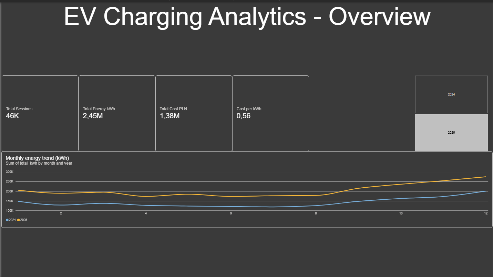

# EV Charging Analytics
End-to-end data platform for EV charging networks: synthetic-but-realistic data
generation → medallion architecture in Databricks → SQL analytics → Power BI
dashboard with tariff what-if scenarios.

## Architecture

**Data volume per layer:**

| Layer | Records | Change |
|---|---:|---:|
| Bronze (raw) | 80.8k | — |
| Silver (deduped) | 80.0k | −1.0% |
| Gold (clean) | 78.4k | −2.0% |

**Anomaly budget:** ~3% of records reconciled across layers.

## Key insights

1. **Cost concentrates in the public day window.** The public segment generates
   ~66% of total cost (1.49M of 2.25M PLN) from ~30% of sessions, paying
   0.727 PLN/kWh — nearly double home (0.390) and work (0.334) rates.

2. **Demand is structurally bimodal — and shift-friendly.** Morning and
   afternoon peaks (~9:00, ~15:00) with a deep night valley; night sessions
   average ~330 min (slow home charging), daytime ~140–210 min (fast public).
   On average ~55% of energy lands in the expensive 13:00–21:00 window —
   stable within 52.6–56.9% for 24 straight months.

3. **Tariff shifting is a measurable lever, not a guess.** Shifting 10 pp of
   day-window volume to a night tariff at a 30% discount is worth
   **~38.1k PLN over 24 months** (~1.6k PLN/month), quantified interactively
   in the Power BI what-if scenario — structural estimate, elasticities not modeled.

Bonus (data quality): the generator's ~3% anomaly budget is **reconciled 1:1
across pipeline layers** — ~1% removed as duplicates, ~2% flagged by Silver
rules (800 aborted, 300 negative, 175 physical-limit, 174 NULL, 151 reversed),
zero silent leaks into Gold. Details in [docs/02](docs/02-medallion-architecture.md).

## What's inside
| Component | Where | Docs |
|---|---|---|
| Data generation (seeded, tested) | `src/` | [docs/01-data-pipeline.md](docs/01-data-pipeline.md) |
| Medallion pipeline (Bronze/Silver/Gold) | `databricks/` | [docs/02-...](docs/...) |
| Analytical SQL views | `analytics/` | [docs/03-...](docs/...) |
| Power BI dashboard | `assets/` | Import mode over Gold views — rationale in [docs/04](docs/04-powerbi-dashboard.md) |
| FinOps estimate | `docs/05-finops.md` | [docs/05](docs/05-finops.md)  |

## Production considerations

What I would change moving from this showcase to a production platform:

- **Orchestration & scheduling**: notebooks run manually today (Run All);
  in production — Databricks Workflows (Jobs) chaining Bronze → Silver → Gold
  with dependency-aware scheduling and SLAs, triggered by arrival of source
  files (Auto Loader / file-arrival trigger) instead of a one-shot CSV upload.
- **Incremental processing**: full-refresh (`overwrite`) everywhere; in
  production — Auto Loader with checkpointing for Bronze, MERGE-based
  incremental Silver keyed on `session_id`, and partitioning by date
  for Silver/Gold Delta tables (daily partitions).
- **Data quality gates**: rules live in Silver `CASE` statements today;
  in production — declarative expectations (e.g. Lakehouse / Delta Live Tables
  expectations or Great Expectations) with quarantine tables and blocking
  thresholds, instead of flag-only review queues.
- **Alerting & observability**: anomaly-rate SLOs (current ~2% flagged share
  reconciled per run), freshness alerts (no-data alerts per source), and
  lineage via Unity Catalog tags.
- **BI serving**: CSV hand-off replaced by a dedicated SQL Warehouse endpoint;
  Power BI over the same Import-mode views, refreshed on schedule; DirectQuery
  reserved for drills on hot aggregates if scale demands it.
- **Model differentiation**: sessions table grows append-only; CDC-style
  differential loads (change feed / incremental source) instead of full rewrites.
