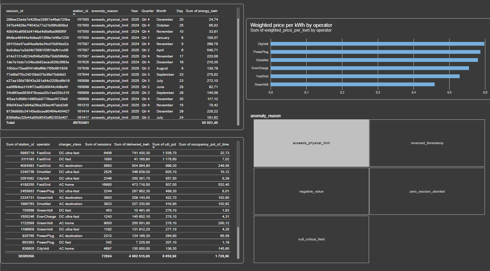
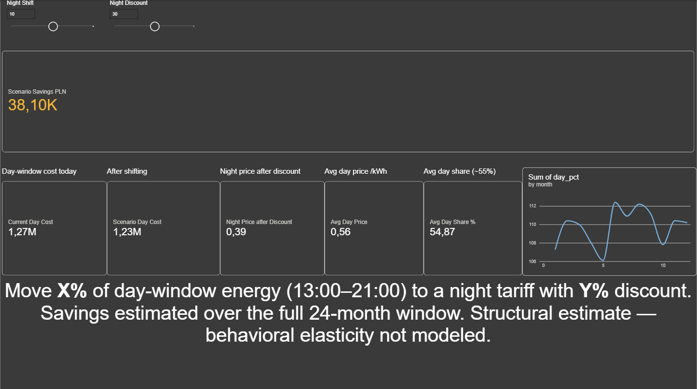
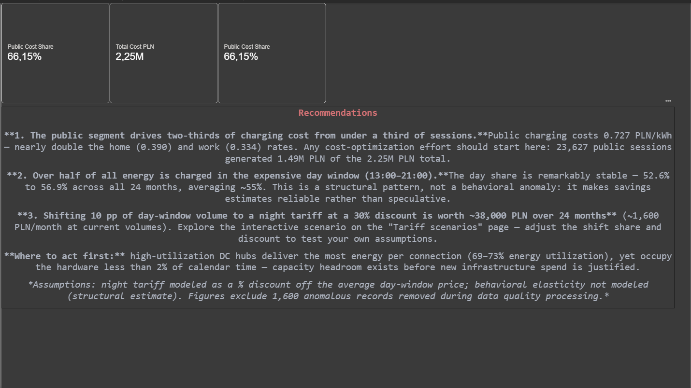

# Power BI Dashboard

## Import vs DirectQuery — design decision

Chosen: **Import mode** over the analytical views.

- Data volume: ~78k fact rows + small aggregates — well inside Power BI's
  in-memory comfort zone; DirectQuery benefits apply to billions of rows, not this scale.
- Dashboard UX: Import enables full DAX (what-if parameters, calculated measures)
  and sub-second interactions; DirectQuery adds latency on every visual.
- Tariff what-if scenarios require What-If parameters and calculated measures —
  impractical in DirectQuery against a live warehouse.
- Source governance: the Databricks layer owns transformations (medallion) and
  exposes only curated views; the BI layer owns presentation, not business logic.
DirectQuery would tempt report-level transformations — a known anti-pattern
in migration projects.

## Data model

Classic star schema — one fact, two dimensions — built in Power BI Model view:

dim_station dim_time (operator, power, (calendar: date, year, month, charger_class) quarter, day_of_week, is_weekend) ▲ ▲ │ *:1 single │ *:1 single │ │ fact_sessions (78,400 clean sessions; measures: energy_kwh, cost_pln, duration_minutes; attributes: session_type, tariff_period, hour_of_day)

- **Relations**: exactly two — `fact_sessions[station_id]` → `dim_station[station_id]`
  and `fact_sessions[date_key]` → `dim_time[date_key]`, both Many-to-one,
  single cross-filter direction (dimensions filter the fact).
- **Aggregate views (`v_*`) are loaded relation-less** — they serve dedicated
  visuals directly and are deliberately kept outside the star schema. Wiring
  facts to aggregates (or aggregates to each other) creates ambiguous filter
  paths and double counting; Power BI's auto-detect proposed several such
  connections (including a 1:1 join between two aggregate tables on a *measure*
  column) — all removed, two star relations created manually.
- **Verification**: BI totals reconcile exactly with the SQL layer
  (78,400 sessions / 4.16 GWh / 2.25M PLN), confirming the model
  introduces neither inflation nor loss.

## Measures (DAX)

All custom measures live in a dedicated hidden `_measures` table;
parameter measures (`*_Value`) stay inside their parameter tables.

| Measure | Definition (essence) | Purpose |
|---|---|---|
| `Total Sessions` | `COUNTROWS(fact_sessions)` | Headline KPI |
| `Total Energy kWh` | `SUM(energy_kwh)` | Headline KPI |
| `Total Cost PLN` | `SUM(cost_pln)` | Headline KPI |
| `Cost per kWh` | `DIVIDE([Total Cost PLN], [Total Energy kWh])` | The weighted unit price — the honest average (volume-weighted, not arithmetic mean of session prices) |
| `Avg Duration Min` | `AVERAGE(duration_minutes)` | Segment behaviour context |
| `Anomaly Count` | `COUNTROWS(v_anomaly_review)` | Makes data quality tangible in BI (1,600 records) |
| `Current Day Cost` | `CALCULATE([Total Cost PLN], tariff_period = "day")` | Baseline for the scenario |
| `Day Energy kWh` | day-window energy | Denominator of the day price |
| `Avg Day Price` | `DIVIDE([Current Day Cost], [Day Energy kWh])` | Unit price inside the expensive window |
| `Night Price after Discount` | `[Avg Day Price] × (1 − discount)` | Scenario unit price |
| `Scenario Savings PLN` | shifted kWh × (day price − discounted night price) | The business impact number |
| `Scenario Day Cost` | `[Current Day Cost] − [Scenario Savings PLN]` | Before/after comparison |
| `Public Cost Share` | public cost ÷ total cost | The 66%-concentration insight, as a card |

Notes: `DIVIDE` everywhere instead of `/` (blank-safe); the what-if parameter
measures carry explicit DAX fallbacks (next section).


- **Relations**: exactly two — `fact_sessions[station_id]` → `dim_station[station_id]`
  and `fact_sessions[date_key]` → `dim_time[date_key]`, both Many-to-one,
  single cross-filter direction (dimensions filter the fact).
- **Aggregate views (`v_*`) are loaded relation-less** — they serve dedicated
  visuals directly and are deliberately kept outside the star schema. Wiring
  facts to aggregates (or aggregates to each other) creates ambiguous filter
  paths and double counting; Power BI's auto-detect proposed several such
  connections (including a 1:1 join between two aggregate tables on a *measure*
  column) — all removed, two star relations created manually.
- **Verification**: BI totals reconcile exactly with the SQL layer
  (78,400 sessions / 4.16 GWh / 2.25M PLN), confirming the model
  introduces neither inflation nor loss.

## Measures (DAX)

All custom measures live in a dedicated hidden `_measures` table;
parameter measures (`*_Value`) stay inside their parameter tables.

| Measure | Definition (essence) | Purpose |
|---|---|---|
| `Total Sessions` | `COUNTROWS(fact_sessions)` | Headline KPI |
| `Total Energy kWh` | `SUM(energy_kwh)` | Headline KPI |
| `Total Cost PLN` | `SUM(cost_pln)` | Headline KPI |
| `Cost per kWh` | `DIVIDE([Total Cost PLN], [Total Energy kWh])` | The weighted unit price — the honest average (volume-weighted, not arithmetic mean of session prices) |
| `Avg Duration Min` | `AVERAGE(duration_minutes)` | Segment behaviour context |
| `Anomaly Count` | `COUNTROWS(v_anomaly_review)` | Makes data quality tangible in BI (1,600 records) |
| `Current Day Cost` | `CALCULATE([Total Cost PLN], tariff_period = "day")` | Baseline for the scenario |
| `Day Energy kWh` | day-window energy | Denominator of the day price |
| `Avg Day Price` | `DIVIDE([Current Day Cost], [Day Energy kWh])` | Unit price inside the expensive window |
| `Night Price after Discount` | `[Avg Day Price] × (1 − discount)` | Scenario unit price |
| `Scenario Savings PLN` | shifted kWh × (day price − discounted night price) | The business impact number |
| `Scenario Day Cost` | `[Current Day Cost] − [Scenario Savings PLN]` | Before/after comparison |
| `Public Cost Share` | public cost ÷ total cost | The 66%-concentration insight, as a card |

Notes: `DIVIDE` everywhere instead of `/` (blank-safe); the what-if parameter
measures carry explicit DAX fallbacks (next section).

## Tariff what-if scenario

Two numeric-range parameters (Modeling → New parameter), each bound to a slicer
on the Scenarios page:

| Parameter | Range | Step | DAX fallback |
|---|---|---|---|
| `Night Shift` — pp of day-window energy moved to night | 0–20 | 1 | `SELECTEDVALUE('Night Shift'[Night Shift], 10)` |
| `Night Discount` — night price reduction vs avg day price | 10–50 | 5 | `SELECTEDVALUE('Night Discount'[Night Discount], 30)` |

Scenario logic (chain of three measures):

```dax
Scenario Savings PLN =
VAR ShiftShare = 'Night Shift'[Night Shift Value] / 100
VAR ShiftedKwh = [Day Energy kWh] * ShiftShare
RETURN
    ShiftedKwh * ([Avg Day Price] - [Night Price after Discount])
```

Baseline estimate — **~38.1k PLN savings over the full 24-month window**
(~1.6k PLN/month) at 10 pp shift / 30% discount:

- day-window energy ≈ 2.23M kWh (stable 52.6–56.9% of monthly volume),
- avg day price ≈ 0.57 PLN/kWh,
- savings = 2.23M × 10% × (0.57 − 0.57×0.70) ≈ 38k PLN.

Two design choices worth naming: (1) the fallback values in `SELECTEDVALUE`
guarantee the dashboard always shows the baseline scenario instead of blanks
when slicers are cleared; (2) the estimate is **structural** — it assumes the
day/night split pattern holds (it has, for 24 straight months) and does not
model behavioral elasticity, which is stated explicitly on the canvas.

## Pages

### Overview
Cards: sessions / energy / cost / cost-per-kWh; monthly trend line; year slicer.


### Costs
Operator price comparison (weighted PLN/kWh), station utilization table,
anomaly review drill-down (1,600 records, filterable by reason).


### Tariff scenarios
What-if parameters: day→night shift share (0–20 pp) × night discount (10–50%).
Baseline estimate: **~38.1k PLN savings over 24 months** at 10 pp / 30% discount.


### Recommendation
Hard-number summary with supporting KPI cards.
